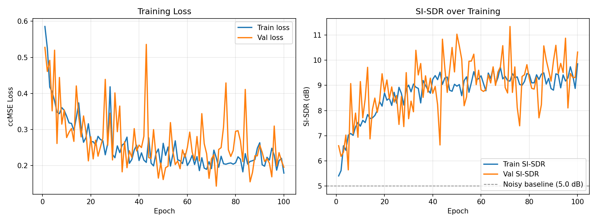

# CRUSE Speech Enhancement (PyTorch)

A from-scratch PyTorch reproduction of **CRUSE** (Convolutional Recurrent U-Net for Speech Enhancement), a compact convolutional-recurrent network for real-time single-channel noise suppression.

> S. Braun, H. Gamper, C. K. A. Reddy, I. Tashev, ["Towards Efficient Models for Real-Time Deep Noise Suppression,"](https://arxiv.org/abs/2101.09249) ICASSP 2021.

Implemented as part of a Master's-level Deep Learning / Signal Processing course exercise, then cleaned up and extended into a standalone package.

<p align="center">
  
</p>

## Highlights

- **CRUSE4-128-1×GRU4** architecture: 4 convolutional encoder/decoder layers (filters 16-32-64-128), 1×1-conv skip connections, and a bottleneck of 4 parallel single-layer GRUs — ~2.15M parameters.
- Trained with a **complex-compressed spectral MSE (ccMSE) loss** and an **STFT-consistency** step (mask → waveform → re-STFT → loss), following the paper's training recipe.
- Evaluated with **Scale-Invariant SDR (SI-SDR)** on held-out clean/noise mixtures.
- Clean, modular codebase (`src/`) with CLI scripts for training and evaluation, plus a small notebook for listening to results.

## Results

| Metric | Noisy | Enhanced |
|---|---|---|
| SI-SDR (mean, dB) | 5.00 | 9.51 |
| SI-SDR improvement (SI-SDRi, mean, dB) | — | **+4.51** |

*Evaluated on held-out test mixtures at a fixed 5 dB input SNR (16 kHz), after 100 training epochs.*

## Architecture

```
Input: log-power spectrogram (B, 1, T, 129)
         │
   ┌─────┴─────┐
   │  Encoder  │  4× Conv2d(k=(2,3), s=(1,2)) + LeakyReLU   [1→16→32→64→128 channels]
   └─────┬─────┘
         │  (skip connections via 1×1 conv at each scale)
   ┌─────┴─────┐
   │ Bottleneck│  4 parallel single-layer GRUs over (128×9)-dim flattened features
   └─────┬─────┘
   ┌─────┴─────┐
   │  Decoder  │  4× ConvTranspose2d(k=(2,3), s=(1,2)) + LeakyReLU/Sigmoid [128→64→32→16→1]
   └─────┬─────┘
         │
Output: time-frequency gain mask G ∈ [0, 1] (B, 1, T, 129)
         │
   enhanced STFT = noisy STFT ⊙ G  →  iSTFT  →  enhanced waveform
```

STFT: 16 kHz, 256-point FFT (129 bins), 16 ms square-root-Hann window, 50% overlap.

## Repository structure

```
.
├── src/
│   ├── model.py        # CRUSE architecture
│   ├── data.py         # on-the-fly noisy mixture dataset & dataloaders
│   ├── audio.py        # STFT / iSTFT / feature extraction utilities
│   ├── losses.py        # ccMSE spectral loss
│   └── metrics.py       # SI-SDR
├── train.py             # training CLI
├── evaluate.py           # evaluation CLI (+ optional audio export)
├── notebooks/
│   └── demo.ipynb        # load a checkpoint and listen to a sample
├── assets/
│   └── training_curve.png
└── checkpoints/          # trained weights go here (not tracked in git)
```

## Setup

```bash
git clone https://github.com/Nima-Azimi-SH/cruse-speech-enhancement.git
cd cruse-speech-enhancement
pip install -r requirements.txt
```

## Data

This repository does not include any audio data (the original training data was provided as part of a university course and is not redistributable). To train or evaluate, point the scripts at your own folders of 16 kHz mono `.wav` files:

```
Signals/
├── Clean_Train/   # clean speech, training
├── Clean_Val/     # clean speech, validation
├── Clean_Test/    # clean speech, test
└── Noise/         # noise recordings (shared across splits)
```

Suitable public sources include the [Microsoft DNS-Challenge](https://github.com/microsoft/DNS-Challenge) speech and noise corpora (the same data family used in the original CRUSE paper), or any other 16 kHz clean-speech / noise dataset of your choice. Clean/noise pairs are mixed on-the-fly at a random SNR (training) or a fixed 5 dB SNR (validation/test) — see `src/data.py`.

## Training

```bash
python train.py \
    --clean_train_folder Signals/Clean_Train \
    --clean_val_folder Signals/Clean_Val \
    --noise_folder Signals/Noise \
    --save_path checkpoints/cruse_best.pth \
    --num_epochs 100 \
    --batch_size 8 \
    --lr 8e-5
```

Run `python train.py --help` for all options.

## Evaluation

```bash
python evaluate.py \
    --clean_test_folder Signals/Clean_Test \
    --noise_folder Signals/Noise \
    --checkpoint checkpoints/cruse_best.pth \
    --export_example_dir assets/example_audio
```

Prints mean/variance SI-SDR for the noisy and enhanced signals, plus the mean improvement, and (optionally) saves one noisy/enhanced/clean `.wav` triplet for a quick listen. For an interactive version with inline audio playback, see `notebooks/demo.ipynb`.

## Acknowledgements

- Architecture and training recipe based on Braun et al., ["Towards Efficient Models for Real-Time Deep Noise Suppression"](https://arxiv.org/abs/2101.09249), ICASSP 2021.
- Original implementation developed for a Master's course exercise (Speech and Audio Signal Processing) at Ruhr-Universität Bochum; cleaned up and restructured for public release.

## License

[MIT](LICENSE)
